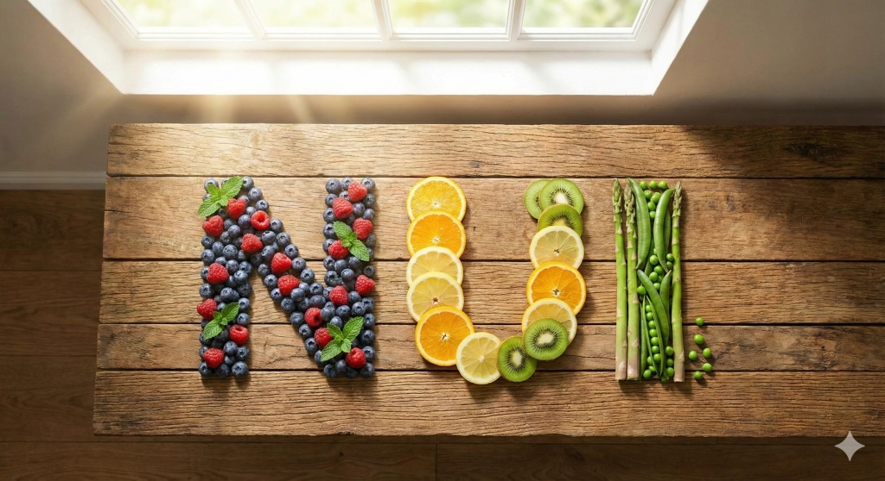

<!-- mb:block repeat=header -->
**NUI Presentation** — MD-Blocks Slide Engine
<!-- mb:/block -->

<!-- mb:block repeat=footer -->
*Press Space or Arrow keys to navigate &bull; 'f' for fullscreen*
<!-- mb:/block -->

# Designing Invariant UI

A presentation engine powered by **MD-Blocks** and native Web Components.

<!-- mb:block id=hero preset=lead -->
Every slide in this deck is composed inside an invariant $16:9$ canvas, scaled to fit any display without layout degradation.
<!-- mb:/block -->

<!-- mb:block preset=card:note -->
**Zero Dependencies:** Rendered natively with `<nui-slides>` wrapping `<nui-markdown>`.
<!-- mb:/block -->

---

# Architecture & Separation of Concerns

<!-- mb:columns weights=[1,1] -->
<!-- mb:col -->
### Document Layer (MD-Blocks)
- Authored in standard CommonMark
- Semantic directives in HTML comments
- Document chrome authored once per main
- Structural breaks via root-level `---`

<!-- mb:col -->
### Presentation Profile (`nui-slides`)
- Fixed canvas coordinate system ($1280 \times 720$)
- Responsive auto-scaling via CSS transforms
- Non-visible slides made `inert` for A11y
- Derived slide numbering and focus management
<!-- mb:/columns -->

---

# Multi-Column Layout & Visual Media

<!-- mb:columns weights=[1,1] -->
<!-- mb:col -->
<!-- mb:block id=slide-plate preset=image:hero -->


Media blocks automatically map to `<figure>` and `<figcaption>`.
<!-- mb:/block -->

<!-- mb:col -->
### High Density Composition

Columns adapt cleanly within the fixed logical canvas:

1. **Deterministic Scaling:** Dimensions calculate relative to the canvas aspect ratio.
2. **Repeating Chrome:** Notice the header and footer persist across all slides without duplicate markup.
3. **Discrete Surfaces:** No accidental scrollbars or layout reflows.
<!-- mb:/columns -->

---

# Code & Design Tokens

Slide decks can include interactive code and styling constructs:

```javascript
import { nui } from 'NUI/nui.js';
import 'NUI/lib/modules/nui-slides.js';

// Programmatic control is simple and reactive
const deck = document.querySelector('nui-slides');
deck.addEventListener('nui-slide-change', (e) => {
    console.log(`Now on slide ${e.detail.index + 1} of ${e.detail.count}`);
});
```

<!-- mb:block preset=card:warning -->
**Tip:** Use keyboard shortcuts (`ArrowRight`, `Space`, `ArrowLeft`, `Home`, `End`) or press **F** to present fullscreen.
<!-- mb:/block -->

---

# Conclusion & Takeaways

<!-- mb:columns weights=[1,1,1] -->
<!-- mb:col -->
### Pure Markdown
Zero framework lock-in. Decks are readable on GitHub, VS Code, and terminal viewers.

<!-- mb:col -->
### Native Standards
Custom elements, CSS variables, and native events power the presentation.

<!-- mb:col -->
### Scalable Canvas
One codebase scales seamlessly from mobile preview cards to 4K projector displays.
<!-- mb:/columns -->

<!-- mb:block preset=lead -->
*Thank you for watching.*
<!-- mb:/block -->
