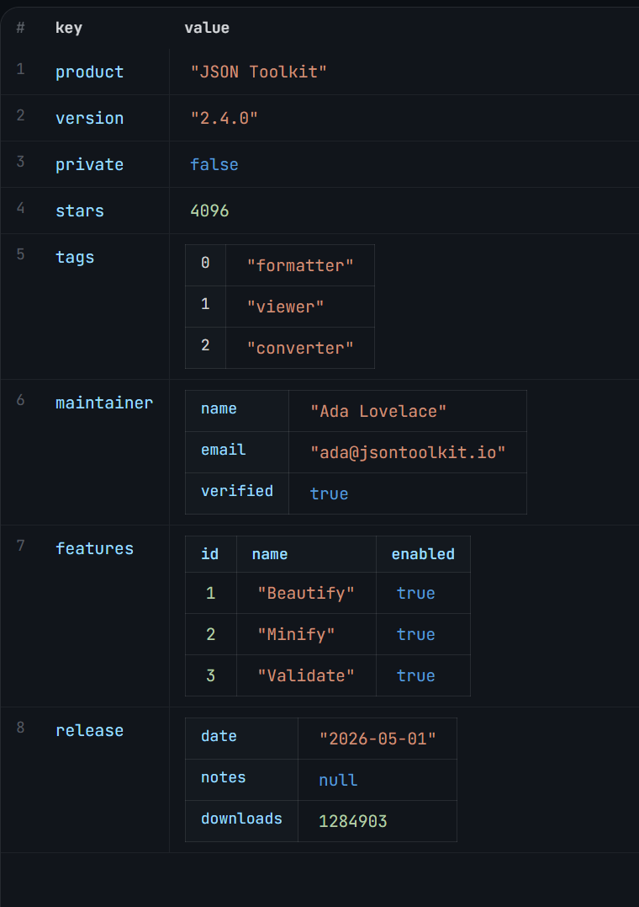

# JSON Grid — visual reference

**Source:** `https://jsontoolkit.io/json-editor`, Grid view, dark scheme, default sample document.
Captured 2026-09-29 as a design reference for `nui-json-grid`.



`images/json-grid-reference.png` is the screenshot. Everything below is its buildable
transcription: what the pixels show, restated as rules that can be implemented and tested
without the image open.

---

## What the screenshot establishes

A root object rendered as a **key/value grid**, with **recursive value rendering**: a
value cell renders its own value using the same grammar, so a nested container becomes
a bordered sub-table rather than a stringified blob. There is no stringify-and-trap
step, and there is no "open" affordance — the nesting is visible at a glance, one
level deep per table, indefinitely.

The decisive idea, and the thing the current design does *not* have: **the shape of a
value decides the shape of its own sub-table's columns.** No fixed schema, no
rectangular assumption, no "the header row is the union of keys" for objects.

---

## Layout grammar

### Root grid

| Column | Content | Notes |
|---|---|---|
| `#` | Row index, 1-based | Dim, right-aligned, monospace, non-interactive |
| `key` | Property name | Identifier colour |
| `value` | The value, rendered by the shape rule below | Natural width — does **not** stretch to fill |

Header row is dim and small with a hairline beneath. Rows are separated by full-width
hairlines. No vertical rules. Generous row height (cells carrying a nested sub-table
grow to contain it; a row's key cell stays top-aligned with the sub-table, not centred
against it).

### Shape rule — a value renders as one of four things

| Value | Rendering | Sub-table columns |
|---|---|---|
| scalar | Inline, type-coloured, no box | — |
| array of scalars | Bordered sub-table, **no header** | index (`0`,`1`,`2`…) + value |
| object | Bordered sub-table, **no header** | key + value |
| array of objects | Bordered sub-table, **with header row** | union of keys across the array |

Worked examples from the sample document, all four cases visible in one screenshot:

- `"tags": ["formatter","viewer","converter"]` → index + value columns, no header.
- `"maintainer": { name, email, verified }` → key + value columns, no header.
- `"features": [{id,name,enabled} × 3]` → **header row** `id | name | enabled`, then records.
- `"release": { date, notes, downloads }` → key + value, `notes: null` rendered as a
  keyword-coloured `null`, not as an empty cell. **A null is visibly a null.**

Arrays of objects are the only shape that gets a header, because the union of keys is
the actual information in that table — without a header the record is unreadable.
An object does not get one because its keys *are* already the left column.

### Type colour

Colours are by **type**, applied to scalars only — the grid knows the type, so this is
a lookup, not a regex pass:

| Type | Role in the screenshot |
|---|---|
| property key / identifier | blue |
| `true` / `false` | same blue as keys — keywords, not data |
| string | warm orange, **including the quotes** |
| number | green |
| `null` | desaturated teal — present but inert |

Quoting is literal and visible. This is the difference between `"2.4.0"` reading as a
string and `4096` reading as a number at a glance, which is the entire point of a grid
over a code view.

### Borders

Hairline box **around nested sub-tables only**. Row separators are full-width hairlines
across the root grid. The root grid itself has no outer border. In NUI terms this is
`--border-thickness` throughout — never a hardcoded `1px`, per the table-editor lesson
that chrome quantises border-width to whole device pixels.

---

## What is deliberately absent from the screenshot

- No grips, no selection chrome, no context menu, no `+` affordances. The table-editor
  principle applies unchanged: **chrome appears on selection, not on hover.** The
  screenshot is a grid at rest, so it is showing the resting state only.
- No breadcrumb, no view tabs, no status bar. Those belong to the four-view chrome,
  which is a Playground concern, not the grid's.
- No light scheme. Sampled from dark only — **the palette must be derived from the
  theme's existing variables, not from these pixels.** `nui-theme.css` has no semantic
  type-colour tokens today, so this build introduces the first ones; they are the one
  genuinely new CSS surface in the project and should be named for role
  (`--json-type-string`, `--json-type-number`, …), never for hue.

---

## Implied decisions

1. **The value cell is a renderer, not a text node.** One recursive function, four
   cases, keyed off `Array.isArray` and `typeof`. This is the whole component's shape
   rule and it should be a pure function returning a descriptor — testable without a DOM.
2. **Object keys are discovered from the data, in insertion order**, not sorted and not
   from a union. `product, version, private, stars, tags, maintainer, features, release`
   is document order, and the editor should not reorder a human's file behind their back.
3. **`null` is a first-class renderable value.** It must never collapse to an empty
   cell — an empty cell is indistinguishable from a key that is missing.
4. **The `#` column is chrome, not data.** It is the one column the user cannot edit,
   which makes it the natural place to hang the row grip later.
5. **Arrays of objects define their own columns.** This is where the earlier
   "union-of-keys header" idea actually belongs — it was being applied to the whole
   grid, and it is only correct for this one shape.

---

## The text contract

Decided 2026-09-29: **text owns the document. The structure is a representation.**

```
structural edit → mutate structure → serialize → SET TEXT → parse → render
```

Three consequences that are not optional — they are what makes the model coherent:

1. **There is exactly one writer of the document text.** The grid never holds a
   state the text does not support, not even transiently. A cell's commit point is
   "produced a valid serialization", not "updated the model".
2. **A cell edit is atomic or it did not happen.** Coerce the cell's raw input,
   mutate a *clone*, serialize the clone. If serialization succeeds, commit to the
   text. If it does not, the cell stays in edit mode and says why. A half-applied
   structural edit is data loss.
3. **Undo is a stack of text strings.** This is free here and was not free in
   `nui-table-editor`, which punted undo to the host and was right to — a DOM
   rebuild is not something `execCommand`'s undo stack can see. Text snapshots need
   no structural undo logic at all.

### What it costs, stated plainly

- **Formatting is not preserved across a structural edit.** One-line objects come
  back expanded at the serializer's indentation. Whitespace is not information, so
  this is the right trade for JSON.
- **YAML comments do not survive a structural edit.** A comment is not data; it
  cannot survive parse → serialize. The Code view preserves them only until the
  first structural change. This is the accepted price of the decision, and it is
  why the text is the truth: the loss is visible and immediate rather than silent.
- **The Code view is the truth-editor, not a view.** It and the grid are two
  editors of one document and they can disagree. That disagreement needs a name: an
  unparseable document has no structure, so the grid shows the parse error with
  line/column and offers no stale fallback.

### The property this rests on

Every edit is a `serialize → parse` round trip. A shape that cannot survive it
corrupts the file **silently** — no exception, just a document that quietly stops
matching what the grid shows. So the round trip is tested, not assumed:

- Suite: `NUI/lib/modules/nui-format-roundtrip.js` (43 fixtures × every format)
- Page: `#page=experiments/format-roundtrip`
- Current: **JSON 43/43 · YAML 42/42 + 1 accepted gap**

### Formats — two adapters, one grid

The grid does not know what format it is editing. A value is a value; format enters
at exactly two seams, `parse` and `serialize`, and nowhere else. That is what makes
"supports JSON and YAML" structural rather than a feature built twice.
Adapters live in `NUI/lib/modules/nui-json-format.js`.

**JSON is total.** `JSON.parse` throws on malformed input and reports a position;
`JSON.stringify` round-trips every value a grid can hold. It has no gaps, which is
why its column is empty.

**YAML is a subset** — and that is where all the work went. It round-trips
everything it emits, but does not support block scalars (`|`, `>`), flow *mappings*
(`{a: 1}`), anchors, multiple documents, tags, or date scalars.

**And `parseYaml` does not report errors.** It is best-effort: a line it cannot
read ends a block, a bad indent yields `null`, and it returns a *partial* structure
rather than throwing. A `try/catch` around it catches almost nothing. So the editor
cannot rely on a parse failure to notice a broken document.

`parseYamlReport()` closes that: it records `skipped` (lines indented under nothing
that claims them — the signature of a block scalar or a continuation line) and
`leftover` (lines never reached), and `verifyYaml()` refuses the document with the
**line number** when either is non-empty. YAML now reports *where* it gave up.

> A guard that can decline to fire must be tested firing. The first version of
> `verifyYaml` used only a fixed-point check and **passed a document it had silently
> thrown away** — `parseYaml('hello')` returns `{}`, and `{}` is a perfectly stable
> fixed point. The model suite caught it in one run.

**Format capability is not editor capability.** JSON genuinely round-trips a
scalar root, which is why it is absent from the YAML accepted-gap list. The grid
still cannot *open* one, because a bare value has no key/value layout to render.
Two different limits; `assertEditableRoot()` enforces the second.

---

## The model layer

`NUI/lib/modules/nui-json-model.js` — pure functions, no DOM.

**`applyEdit()` is the only function that produces a new document.** Everything else
is a pure structure mutation, and there is no second path from a mutation to text:

```
clone → mutate → serialize → RE-PARSE → compare → assert root → return
```

The re-parse is the point. The round-trip suite proves *the fixtures* survive; it
cannot prove the next shape, or the next edit. Re-parsing on every commit costs one
extra parse of a config-sized document and turns the next silent corruption into a
**thrown error with the text unchanged** — the difference between a ruined file and
a refusal. Verified by `#page=experiments/json-model` (27 cases).

| Piece | Notes |
|---|---|
| JSON Pointer paths | RFC 6901. It is the wire format — what "copy path" hands the clipboard |
| `renameKey` | Rebuilds the parent in place so the key **keeps its position** |
| `convertTo` | Returns `{ok}` or `{ok:false, reason}`. **No lossy path exists** — a container → scalar conversion is refused, naming what would be discarded |
| `inferColumnType` | Infers **type**, not shape. Two maps with different keys are still two maps; `mixed` means the types differ |
| `createHistory` | Undo as a text-snapshot stack, free because text owns the document. Consecutive edits to one cell coalesce — typing is one intention, not one step per keystroke |

Four real defects were found and fixed this way, all of them silent corruption, and
**all four were invisible by reading the code**:

| Shape | What happened |
|---|---|
| `{'a:b': 1}` | emitted `a:b: 1`, read back as `{'a': 'b: 1'}` — keys were never quoted *or* unquoted |
| `{"it's": 1}` | emitted bare; the reader's quote tracking never closed, so the key vanished entirely |
| `{"m'x\"y": 1}` | the escaped `"` closed the string early and the separator colon was never found |
| `'line1\nline2'` | emitted bare; the reader is line-oriented, so `line2` was **lost** |

Note the third: fixing the second exposed it. Every one of these looked like a
working feature until something was measured. That is the argument for running the
suite rather than reasoning about it.

### Root scalar — accepted, not fixed

`serializeYaml('hello')` emits `hello`; `parseYaml('hello')` returns `{}`. The same
shape round-trips cleanly through **JSON**, where it is `"hello"` and parses straight
back — which is the point: a gap can be format-specific, so the accepted-gap list is
keyed by format id rather than assumed global.

Deliberately left in the shared parser: `renderFrontmatter` iterates
`Object.entries`, so making a scalar document parse would render a string as
index/character pairs in every markdown file with odd frontmatter.
`assertEditableRoot()` rejects a non-map, non-sequence root at the **editor's**
boundary instead — reject at the edge, don't change a shared parser for a case
nobody has.

### Cell types follow `parseScalar`, not a second opinion

The grid shows `"2.4.0"` quoted, but the text legitimately emits `2.4.0` bare —
unambiguous, so the serializer leaves it alone. The cell's type badge is authoritative
and coercion follows `parseScalar`'s exact rules, so the grid and the parser can never
disagree about what a piece of text means. A second opinion here would produce documents
that re-parse to something other than what the grid shows.
